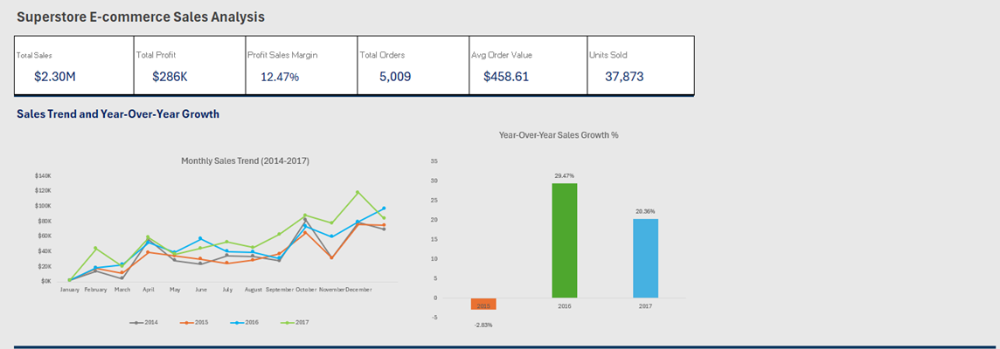
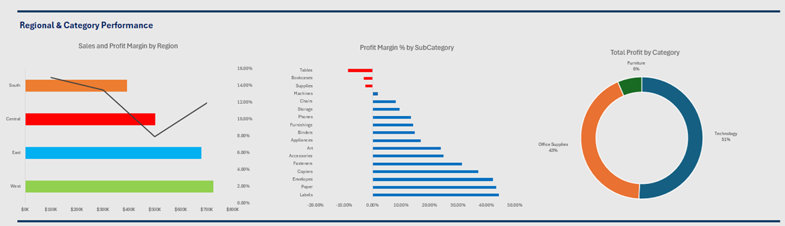
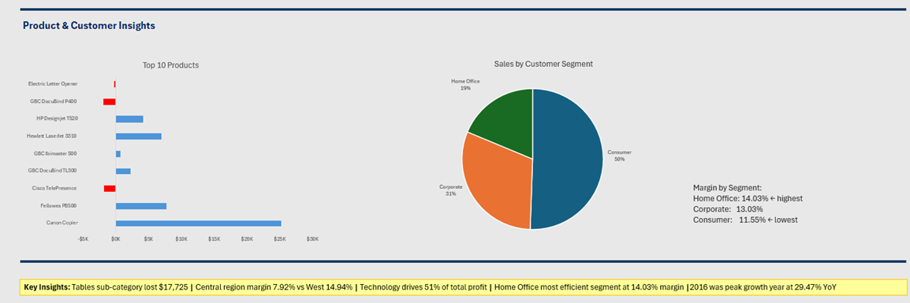
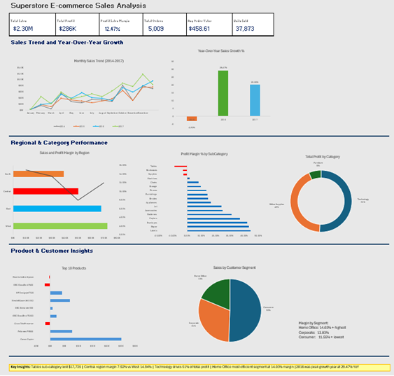

# E-Commerce Sales Analysis Dashboard
### Tools: MySQL 8.0 | Microsoft Excel | Dataset: Sample Superstore (Kaggle)

## Project Overview

This project analyzes 4 years of e-commerce sales data (2014–2017) for a fictional US-based superstore. Using MySQL for data cleaning and analysis, and Microsoft Excel for visualization, I built an end-to-end sales performance dashboard that surfaces actionable business insights across regions, product categories, and customer segments.

## Dashboard

## Stages

**Stage 1 — Data Import & Validation**
- Imported 9,994 rows into MySQL using `LOAD DATA INFILE`
- Diagnosed and fixed a partial-load issue (300 missing rows)
- Validated using row count, duplicate checks, and range checks

**Stage 2 — Data Cleaning**
- Converted date columns from text to SQL `DATE` type using `STR_TO_DATE()`
- Investigated 8 apparent duplicate orders — confirmed legitimate, no action taken
- Validated zero blank fields, zero invalid numeric values

**Stage 3 — SQL Analysis (11 Queries)**
- Overall KPIs: total sales, profit, margin %, orders, AOV, units sold
- Year-over-year growth using `LAG()` window function
- Monthly trend, regional, category, product, segment breakdowns

**Stage 4 — Data Export**
- Exported 11 query results as CSVs into a single Excel workbook
- Named and organized into 11 data sheets + 1 dashboard sheet

**Stage 5 — Excel Dashboard**
- Built SUMIFS pivot table for monthly trend chart
- Created 7 charts: line, bar, horizontal bar, combination, donut, pie

## Author
**Allan Jigi Mathew**  
[LinkedIn](https://www.linkedin.com/in/allan-jigi-mathew/)
